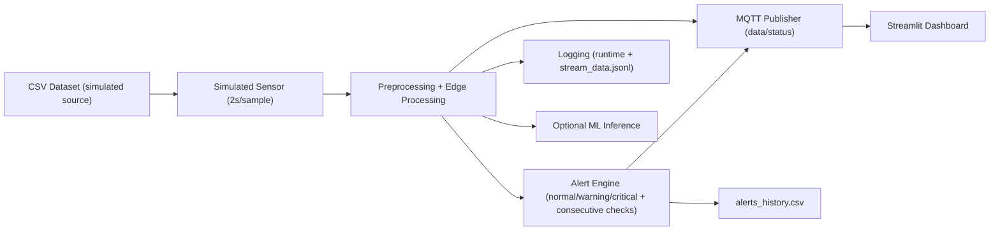

# Système IoT Intelligent (Simulé) de Surveillance de la Qualité de l’Air pour Smart City

Projet académique Python qui transforme le dépôt **Air-Quality-Prediction-Model** en une architecture IoT simulée complète, démontrable localement.

## 1. Contexte académique

Dans ce projet, les capteurs physiques (ex. BME680, PMS5003, Arduino) n’étaient pas disponibles.  
Les données CSV du dépôt source sont donc utilisées pour **simuler la sortie de capteurs** et valider l’architecture logicielle de bout en bout.

Objectif validé :
- pipeline temps réel simulé,
- traitement edge local,
- moteur d’alertes métier,
- publication MQTT,
- visualisation temps réel,
- journalisation,
- couche ML optionnelle.

Cette approche ne prétend pas fournir des mesures physiques réelles. Elle valide la **cohérence fonctionnelle IoT**.

## 2. Analyse du dépôt source (point de départ)

Dépôt source : [Akajiaku11/Air-Quality-Prediction-Model](https://github.com/Akajiaku11/Air-Quality-Prediction-Model)

### Contenu observé
- Plusieurs CSV synthétiques :
  - `air_quality_dataset_1.csv ... air_quality_dataset_10.csv` (fichier `4` absent),
  - `urban_air_quality.csv`,
  - `industrial_zone_air_quality.csv`,
  - `air_quality_city_daily.csv`,
  - `low_cost_sensor_data.csv`,
  - `weather_only_air_quality.csv`.
- Colonnes principales disponibles selon les fichiers :
  - `PM2.5`, `PM10`, `NO2`, `SO2`, `CO`, `O3`, `temperature`, `humidity`, `wind_speed`.
- Scripts existants mais peu structurés (`Air Quality Prediction.py`, `AQP.PY.txt`, `Code`, `Code2`), sans architecture IoT complète.

### Réutilisable
- Les CSV comme base de simulation capteur.
- L’idée de prédiction via RandomForest (réintégrée proprement en module ML optionnel).

### Manques du dépôt initial
- Pas de streaming capteur continu.
- Pas de moteur d’alertes avec anti-faux positifs.
- Pas de couche MQTT opérationnelle.
- Pas de dashboard temps réel intégré.
- Pas d’architecture modulaire exécutable de bout en bout.

## 3. Architecture finale



## 4. Structure du projet

```text
.
├── config/
│   └── settings.yaml
├── data/
│   ├── raw/
│   ├── processed/
│   └── sample/
├── logs/
├── models/
├── notebooks/
│   └── exploration.ipynb
├── src/
│   ├── ingestion/simulated_sensor.py
│   ├── processing/{preprocess.py,edge_processor.py,feature_engineering.py}
│   ├── alerts/alert_manager.py
│   ├── mqtt/{publisher.py,topics.py}
│   ├── ml/{train_model.py,predict.py,evaluate.py}
│   ├── dashboard/app.py
│   ├── utils/{config.py,logger.py,helpers.py}
│   └── main.py
├── tests/
│   ├── test_preprocess.py
│   ├── test_alerts.py
│   └── test_simulated_sensor.py
├── run_demo.py
├── requirements.txt
└── README.md
```

## 5. Mapping des colonnes (source -> projet)

Le prétraitement mappe les colonnes en noms standards :
- `PM2.5` -> `pm25`
- `PM10` -> `pm10`
- `CO` -> `co`
- `NO2` -> `no2`
- `SO2` -> `so2`
- `O3` -> `o3`
- `temperature` -> `temperature`
- `humidity` -> `humidity`
- `wind_speed` -> `wind_speed`
- `date`/`timestamp` -> `source_date`

Gestion des manques :
- si `pm25` absent et `pm10` présent: `pm25 = 0.6 * pm10`,
- si `pm10` absent et `pm25` présent: `pm10 = 1.5 * pm25`,
- `co2` et `tvoc` non disponibles dans le dépôt source : estimation (co2_equivalent / tvoc_estimated) au niveau edge.

## 6. Prérequis

- Python 3.10+
- pip
- (Optionnel) Mosquitto MQTT local

## 7. Installation

### Windows (PowerShell)
```powershell
python -m venv .venv
.\.venv\Scripts\Activate.ps1
pip install -r requirements.txt
```

### Linux/macOS
```bash
python3 -m venv .venv
source .venv/bin/activate
pip install -r requirements.txt
```

## 8. Exécution pas à pas

### 8.1 Prétraiter les données (optionnel mais recommandé)
```bash
python -m src.processing.preprocess --input-csv data/raw/air_quality_combined_source.csv --output-csv data/processed/air_quality_clean.csv
```

### 8.2 Lancer Mosquitto (optionnel)

Si Mosquitto est installé :
```bash
mosquitto -v
```

Si Mosquitto n’est pas lancé, le projet reste fonctionnel :
- publication MQTT en fallback fichier `logs/mqtt_fallback.jsonl`,
- dashboard basé sur `logs/stream_data.jsonl` et `logs/alerts_history.csv`.

### 8.3 Lancer le pipeline IoT simulé
```bash
python -m src.main
```

Mode démo (plus rapide) :
```bash
python run_demo.py
```

Exemple court :
```bash
python -m src.main --demo --max-records 100 --no-loop --no-ml
```

### 8.4 Lancer le dashboard Streamlit
```bash
streamlit run src/dashboard/app.py
```

Le dashboard affiche :
- mesures temps réel,
- statut global coloré (vert/jaune/rouge),
- AQI estimé et score de risque,
- courbes d’évolution,
- historique récent,
- alertes récentes.

## 9. Machine Learning (optionnel)

Le ML **complète** le système, mais ne remplace pas les règles d’alerte temps réel.

### Entraînement hors ligne
```bash
python -m src.ml.train_model --input-csv data/raw/air_quality_combined_source.csv
```

Artefacts générés :
- `models/aqi_pm25_model.joblib`
- `models/aqi_pm25_metrics.json`

### Évaluation
```bash
python -m src.ml.evaluate --input-csv data/raw/air_quality_combined_source.csv
```

### Inférence ponctuelle
```bash
python -m src.ml.predict
```

Pour activer l’inférence ML dans le pipeline temps réel :
```bash
python -m src.main --ml
```

## 10. Alertes métier

Paramétrées dans `config/settings.yaml` :
- seuils `warning` / `critical` par métrique (`pm25`, `pm10`, `co`, `temperature`, `humidity`),
- anti-faux positifs : alerte seulement après `N` dépassements consécutifs (`consecutive_breaches`, défaut `3`).

Sorties alertes :
- runtime log : `logs/runtime.log`,
- historique structuré : `logs/alerts_history.csv`,
- publication MQTT : topic `air_quality/alerts`.

## 11. Tests

```bash
pytest tests
```

Dans certains environnements sandbox Windows :
```bash
pytest tests -p no:cacheprovider -p no:tmpdir
```

## 12. Topics MQTT

- `air_quality/data`
- `air_quality/alerts`
- `air_quality/status`

## 13. Limites

- Données majoritairement synthétiques.
- Certaines relations physiques réelles sont simplifiées.
- `co2` et `tvoc` sont estimés (pas mesurés).
- Performance ML variable selon qualité/cohérence des CSV sources.

## 14. Pistes d’amélioration

- Intégrer de vrais capteurs (BME680/PMS5003) et microcontrôleur.
- Ajouter persistance DB (SQLite/PostgreSQL/InfluxDB).
- Ajouter calibration capteurs et validation métrologique.
- Déployer MQTT + dashboard en conteneurs Docker.
- Ajouter détection d’anomalies temporelles et modèles séquentiels.

---

## Justification académique (à reprendre dans le rapport)

Cette implémentation valide une architecture IoT Smart City en mode simulé :
- acquisition (dataset rejoué comme capteurs),
- edge computing local,
- alerting en temps réel,
- communication MQTT,
- supervision dashboard,
- analytics ML optionnelle.

L’absence de capteurs physiques est compensée par une stratégie de simulation réaliste, ce qui permet une démonstration technique complète et crédible du système logiciel.
